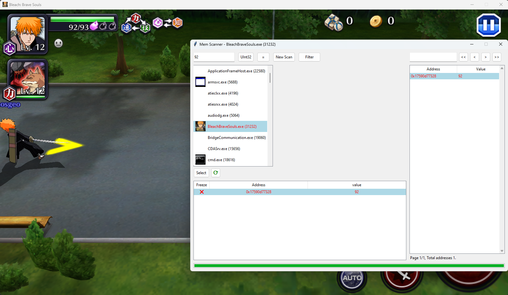

# MemSpy

## About this project
MemSpy is a Python-based tool that is similar to "Cheat Engine", a well-known known cheating program created in Object Pascal and C language. Our tool is the only cheat engine like tool, which runs in Python, making it easier to understand and use. The main objective of this tool is to scan for values into varius memory regions of running applications, allowing users to change or freeze those values.

## Setup and Prerequisites
### Python
Users must already have Python installed on their systems in order for this app to function properly. A few libraries are also necessary for effective operation. The file ```requirements.txt``` contains the necessary libraries. To install them, execute ```pip install -r requirements.txt``` on the terminal. 

### Execution and GUI
To execute the app you must run ```python gui.py```. After that, a window will pop up and user can interact with it.

* In order for someone to begin, he must select the desired application from the left side of the pane. The PID of each process is displayed on the title, and the order of processes is alphabetized.
* After that, the user must click on "Select" button. The list is refreshed when the refresh button is clicked.
* On the upper left corner, there is a search field. The user can enter a value in this box and select the appropriate value type from the drop-down menu (SByte, Int16, Int32, Int64, UInt16, **UInt32**, UInt64, **Float**, Double, **String**).
* Currently only "equals" opperation works for the first Scan ("New Scan")
* After New Scan, some results may appear on the right side of the window. On top of that a filter box is located and user can also move into pages.
* Now user can set a different value on the search box and deside an opperation. Next, user can press the filter button to filter out some values.
* The desired value can be transfered to the left-down box by double clicking the address. In that box user can freeze or change the values using right click.



## Contact
Georgoulas Dimosthenis - dimosgeo99@gmail.com

Papanikolaou Nikolaos - nickp3065@gmail.com
